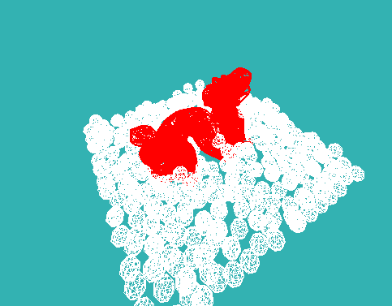

# SimpleFluids

This project can be built for windows machines using Visual Studio 2022. It implements a highly simplified SPH simulation by making local assumptions to emulate viscosity and incompressibility. 

The main function is found within collisions_console.cpp

Currently supported features

 - Fluid particle initialization
 - Loading a convex rigid body from a .obj file
 - Loading a concave rigid body from a vector of .obj files
 - External forces

